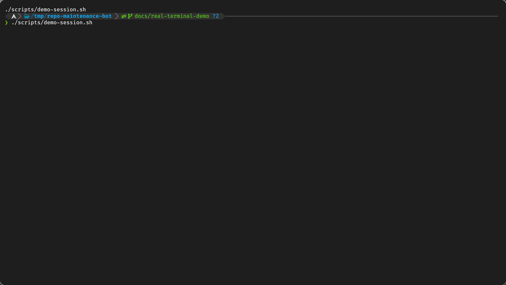

# Repo Maintenance Bot

**English** · [Español](README.md)

> Local, transactional automation to update npm lockfiles, validate the updated tree and create a commit only when the evidence passes.

## Real demo

The demo runs [`scripts/demo-session.sh`](scripts/demo-session.sh) against a temporary npm repository. The bot validates an update in an isolated clone, and the closing step checks that the source repository keeps the same commit, lockfile and a clean working tree. A [static PNG capture](docs/assets/repo-maintenance-bot-demo.png) is also available.

## Why it exists

Updating a lockfile looks like a small task, but validating with the **old node_modules** gives a false sense of safety. Modifying the repository directly can also leave generated files, accidental staged changes, or a dry run that was not really dry.

Repo Maintenance Bot treats every update as an isolated transaction:

1. It rejects repositories with local changes.
2. It creates a temporary local clone.
3. It runs **npm update --package-lock-only --ignore-scripts**.
4. It rejects any change that is not the expected lockfile.
5. It installs the updated tree with **npm ci**.
6. It runs the **test** and **build** scripts, if they exist.
7. It copies only the validated lockfile back to the original repository.
8. It creates a local commit. Push is optional.

## Verified guarantees

| Scenario | Behavior |
|---|---|
| Repository with local changes | Skipped without touching it |
| Dry run | Validates in the temporary clone and leaves the original intact |
| npm test fails | Rejects the update even if the build could pass |
| npm run build fails | Rejects the update |
| npm changes another file | Rejects the update |
| Tests/build generate files | They do not reach the repository or the commit |
| No real changes | Creates no commit |
| Valid update | Commits only package-lock.json or npm-shrinkwrap.json |
| Push | Disabled by default |

These guarantees are covered by [behavior tests](tests/run.sh) and CI.

## Requirements

- Bash 5.x
- Git
- Node.js and npm
- mktemp and cksum
- A Git identity configured in the repositories where commits are allowed

## Usage

Clone the project and try dry-run mode first:

    git clone https://github.com/AvilaCarlosDev/repo-maintenance-bot.git
    cd repo-maintenance-bot
    REPO_MAINTENANCE_DRY_RUN=1 ./auto-commit.sh ~/code/project-a

Process several repositories and leave local commits:

    ./auto-commit.sh ~/code/project-a ~/code/project-b

Enable push only after reviewing the behavior:

    REPO_MAINTENANCE_PUSH=1 ./auto-commit.sh ~/code/project-a

## Configuration

| Variable | Default | Effect |
|---|---:|---|
| REPO_MAINTENANCE_DRY_RUN | 0 | Runs the whole flow without modifying the original repository |
| REPO_MAINTENANCE_PUSH | 0 | Pushes the commit to the configured remote |
| REPO_MAINTENANCE_SKIP_TESTS | 0 | Skips test/build; reduces the evidence and is not recommended |
| REPO_MAINTENANCE_ALLOW_INSTALL_SCRIPTS | 0 | Allows install scripts during npm ci |
| CHECKPOINT_DIR | ~/.local/state/repo-maintenance-bot/checkpoints | Directory for daily checkpoints |
| LOG_FILE | ~/.local/state/repo-maintenance-bot/repo-maintenance.log | Log file |

The old variables STREAK_KEEPER_DRY_RUN, STREAK_KEEPER_PUSH and STREAK_KEEPER_SKIP_TESTS are temporarily accepted for compatibility but are deprecated.

## Security model

- The temporary clone avoids validating with old dependencies.
- The clone copies its objects and removes its remote before running validations.
- Third-party install scripts are blocked by default with **npm ci --ignore-scripts**.
- Only a known lockfile may be transferred to the original repository.
- Before applying the result, it checks again that HEAD and the working tree did not change during validation.
- The temporary directory is validated before it is removed.

### Limits

- It currently only maintains npm lockfiles.
- The test/build scripts are project code and run with the user's permissions. Use the tool only on trusted repositories; the transactional clone is not a sandbox against malicious code.
- A test that does not exist cannot demonstrate behavior.
- **--ignore-scripts** may prevent installing packages that need compilation. Enable REPO_MAINTENANCE_ALLOW_INSTALL_SCRIPTS only after evaluating that risk.
- The tool does not open PRs, does not merge and does not resolve semantic changes in dependencies.
- An enabled push uses the user's existing remote and Git credentials.

## Automation

There are conservative examples in [examples/](examples/):

- [systemd-example.service](examples/systemd-example.service)
- [systemd-example.timer](examples/systemd-example.timer)
- [cron-example](examples/cron-example)

The examples start in dry-run. None enables push by default.

## Development and tests

    bash -n auto-commit.sh tests/run.sh
    tests/run.sh

The suite creates temporary repositories and uses a controlled npm; it never runs the bot against your real repositories. There are 19 behavior tests: the main guarantees plus edge cases (invalid flag values, no arguments, paths with spaces, no lockfile, a directory that is not a repository, and a missing path that must not stop the other repositories).

**Not tested:** Windows and macOS (CI is Ubuntu only), package managers other than npm, very large repositories, and running with a real `npm` against real registries; the suite uses a fake `npm`.

## About contribution streaks

This project started under another name, aimed at keeping a GitHub streak. That goal was dropped.

**Artificial activity does not demonstrate technical ability.** This tool should only create commits when there is real, validated and reviewable maintenance.

## Security

See [SECURITY.md](SECURITY.md) to report vulnerabilities without publishing sensitive details.

## Credits

Created and maintained by [Carlos Avila](https://github.com/AvilaCarlosDev). Developed with the support of Claude (Anthropic) as an assistant for architecture review and test writing; design decisions and final review are the author's.

## License

MIT — see [LICENSE](LICENSE).
